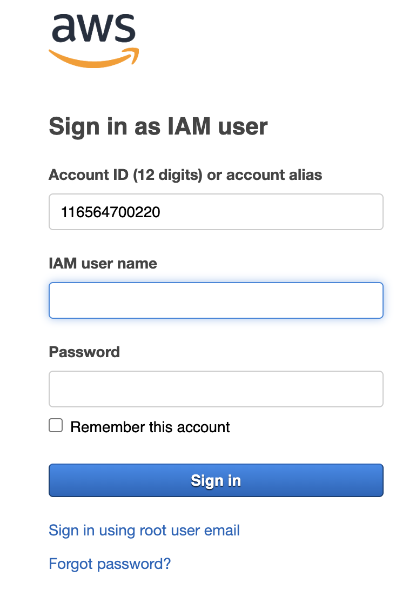
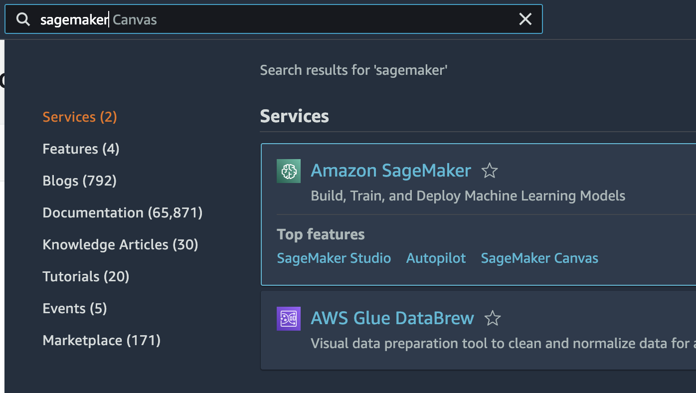
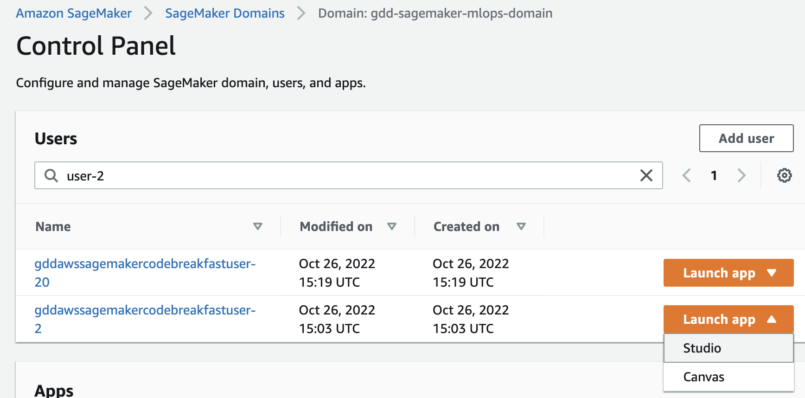
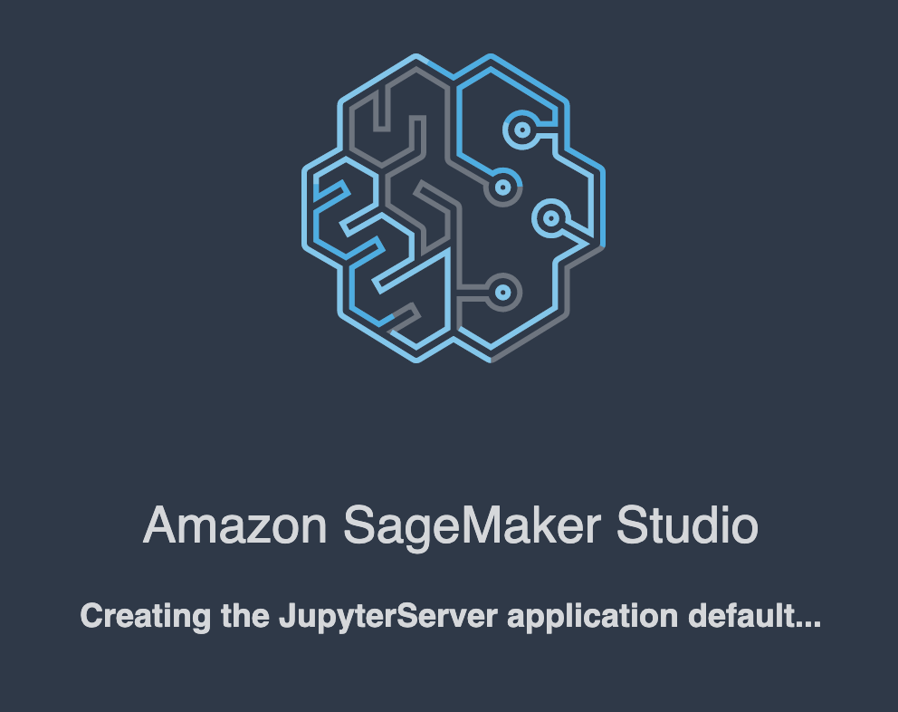
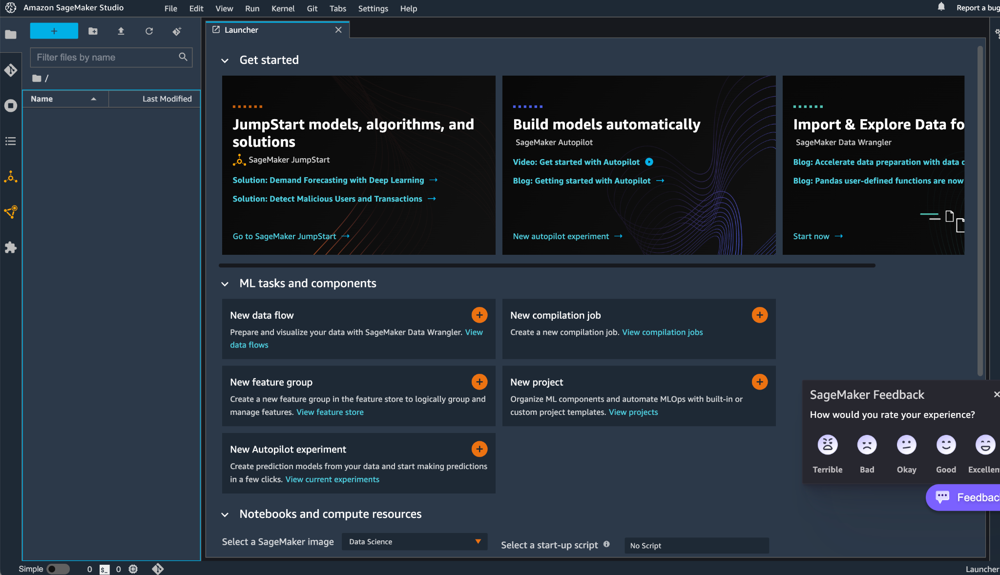
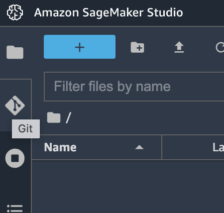
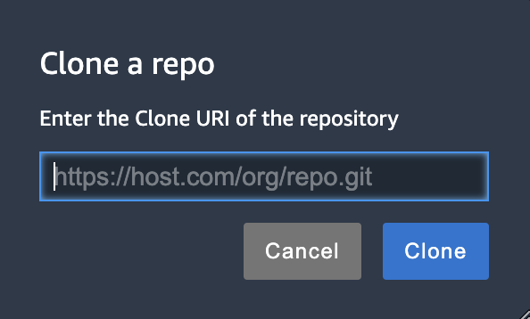
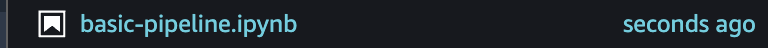
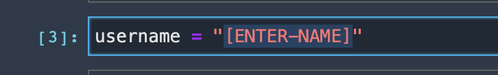

# code-breakfast-aws-sagemaker
Repo for the MLOps CodeBreakfast 🍳 on AWS SageMaker at Thursday the 27th of October


## Setup

Hi! Let's get you logged into the SageMaker Studio environment and start building pipelines.

1. Open up the AWS console:

    [https://116564700220.signin.aws.amazon.com/console](https://116564700220.signin.aws.amazon.com/console)

2. Login with your credentials:

    

3. Open up SageMaker in the AWS console:

    

4. Go to SageMaker **Domains** and filter on your user name:

    e.g. "user-2":

    

    Then click Launch App -> Studio. Give SM Studio a bit of time to launch:

    

    After this SM Studio should have started:

    

5. On the left-hand side, go to Git:

    

    And then click **Clone**:
    
    

    Fill in:

    ```
    https://github.com/godatadriven/code-breakfast-aws-sagemaker.git
    ```

6. Open up the `basic-pipeline.ipynb`:

    

7. Lastly, make sure to modify the username:

    


Good luck! 🍀

## About
Created by Usman Zafar and Jeroen Overschie, working for GoDataDriven.